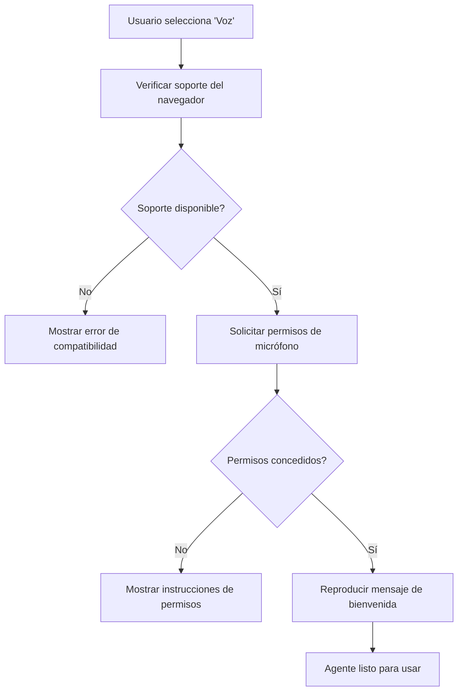
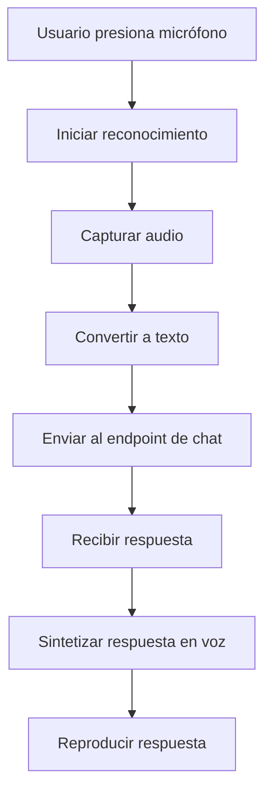

# Agente de Voz - Ecommerce Copilot

## Descripción

El Agente de Voz es una funcionalidad avanzada que permite a los usuarios interactuar con el sistema de ecommerce mediante comandos de voz. Utiliza la Web Speech API de Angular para proporcionar una experiencia de usuario natural y accesible.

## Características Principales

### 🎤 Reconocimiento de Voz
- **Reconocimiento en tiempo real**: Captura y procesa comandos de voz instantáneamente
- **Soporte para español**: Configurado específicamente para el idioma español
- **Interfaz visual intuitiva**: Indicadores visuales del estado de escucha

### 🔊 Síntesis de Voz
- **Respuestas habladas**: El sistema responde verbalmente a las consultas
- **Voz natural**: Utiliza la síntesis de voz del navegador
- **Control de reproducción**: Botón para detener la síntesis en cualquier momento

### 🔄 Integración con API
- **Mismo endpoint**: Utiliza el mismo endpoint que el chat de texto
- **Contexto UI**: Captura el contexto de la interfaz para respuestas precisas
- **Procesamiento inteligente**: Maneja errores y proporciona respuestas contextuales

## Arquitectura

### Principios de Arquitectura Hexagonal

El agente de voz sigue los principios de arquitectura hexagonal para mantener un código limpio y mantenible:

```
┌─────────────────────────────────────────────────────────────┐
│                    PRESENTATION LAYER                      │
├─────────────────────────────────────────────────────────────┤
│  VoiceChatComponent (UI)                                    │
│  - Interfaz de usuario para el chat de voz                 │
│  - Manejo de eventos de usuario                            │
│  - Visualización del estado del agente                     │
└─────────────────────────────────────────────────────────────┘
                              │
                              ▼
┌─────────────────────────────────────────────────────────────┐
│                   APPLICATION LAYER                        │
├─────────────────────────────────────────────────────────────┤
│  VoiceAgentService (Lógica de negocio)                     │
│  - Orquestación del flujo de voz                           │
│  - Manejo de estado del agente                             │
│  - Integración con servicios externos                      │
└─────────────────────────────────────────────────────────────┘
                              │
                              ▼
┌─────────────────────────────────────────────────────────────┐
│                     DOMAIN LAYER                           │
├─────────────────────────────────────────────────────────────┤
│  VoiceServicePort (Puerto/Interfaz)                        │
│  - Contrato para servicios de voz                          │
│  - Definición de métodos requeridos                        │
└─────────────────────────────────────────────────────────────┘
                              │
                              ▼
┌─────────────────────────────────────────────────────────────┐
│                 INFRASTRUCTURE LAYER                       │
├─────────────────────────────────────────────────────────────┤
│  WebSpeechService (Adaptador)                              │
│  - Implementación de Web Speech API                        │
│  - Manejo de reconocimiento y síntesis                     │
│  - Gestión de permisos de micrófono                        │
└─────────────────────────────────────────────────────────────┘
```

### Componentes Principales

#### 1. VoiceServicePort (Puerto)
```typescript
export interface VoiceServicePort {
  requestMicrophonePermission(): Promise<boolean>;
  startSpeechRecognition(): Promise<void>;
  stopSpeechRecognition(): void;
  speakText(text: string): Promise<void>;
  stopSpeaking(): void;
  isSpeechSupported(): boolean;
  getRecognitionState(): 'inactive' | 'listening' | 'processing';
  onSpeechResult(callback: (text: string) => void): void;
  onSpeechError(callback: (error: string) => void): void;
  onSpeechEnd(callback: () => void): void;
}
```

#### 2. WebSpeechService (Adaptador)
- Implementa la Web Speech API
- Maneja permisos de micrófono
- Configura reconocimiento y síntesis de voz
- Gestiona eventos de voz

#### 3. VoiceAgentService (Servicio de Aplicación)
- Orquesta el flujo completo del agente de voz
- Maneja el estado del agente
- Integra con el API de chat existente
- Proporciona respuestas contextuales

#### 4. VoiceChatComponent (Componente de Presentación)
- Interfaz de usuario moderna y atractiva
- Indicadores visuales del estado
- Controles intuitivos para el usuario

## Flujo de Funcionamiento

### 1. Inicialización


### 2. Procesamiento de Voz


## Uso

### Comandos de Voz Soportados

El agente de voz puede procesar comandos como:

- **"Buscar camisetas"** - Busca productos específicos
- **"Mostrar ofertas"** - Muestra productos con descuento
- **"¿Qué productos tienen descuento?"** - Consulta sobre promociones
- **"Buscar zapatos deportivos"** - Búsqueda específica por categoría
- **"Mostrar productos populares"** - Productos destacados

### Interfaz de Usuario

#### Estados Visuales
- **🟢 Listo**: Agente disponible para escuchar
- **🔴 Escuchando**: Capturando audio del usuario
- **🟡 Procesando**: Analizando la consulta
- **🔴 Sin permisos**: Requiere autorización de micrófono
- **⚫ No soportado**: Navegador incompatible

#### Controles
- **🎤 Botón principal**: Inicia/detiene el reconocimiento
- **🔇 Detener síntesis**: Para la reproducción de voz
- **❌ Cerrar**: Cierra la interfaz de voz

## Configuración

### Requisitos del Navegador

- **Chrome**: Versión 25+ (recomendado)
- **Edge**: Versión 79+
- **Safari**: Versión 14.1+
- **Firefox**: No soportado (limitaciones de Web Speech API)

### Permisos Requeridos

- **Micrófono**: Para capturar comandos de voz
- **HTTPS**: Requerido en producción para acceso al micrófono

### Configuración de Desarrollo

```typescript
// En providers.config.ts
export const INFRASTRUCTURE_PROVIDERS: Provider[] = [
  {
    provide: VOICE_SERVICE_PORT,
    useClass: WebSpeechService
  },
  VoiceAgentService
];
```

## Manejo de Errores

### Errores Comunes

1. **Navegador no soportado**
   - Mensaje: "Tu navegador no soporta la funcionalidad de voz"
   - Solución: Usar Chrome, Edge o Safari

2. **Permisos denegados**
   - Mensaje: "Se requieren permisos de micrófono"
   - Solución: Habilitar permisos en configuración del navegador

3. **Error de reconocimiento**
   - Mensaje: "Error de reconocimiento: [tipo de error]"
   - Solución: Verificar conexión y calidad del audio

4. **Error de síntesis**
   - Mensaje: "Error al leer texto"
   - Solución: Verificar configuración de audio del sistema

### Logging y Debugging

```typescript
// Habilitar logs detallados
console.log('Estado del agente:', this.voiceAgentService.getCurrentState());
console.log('Soporte de voz:', this.voiceService.isSpeechSupported());
```

## Mejoras Futuras

### Funcionalidades Planificadas

1. **Reconocimiento continuo**
   - Escucha automática sin presionar botón
   - Detección de palabras de activación

2. **Múltiples idiomas**
   - Soporte para inglés y otros idiomas
   - Detección automática de idioma

3. **Comandos avanzados**
   - Navegación por voz en la tienda
   - Control de carrito de compras
   - Búsqueda por filtros específicos

4. **Personalización**
   - Velocidad de síntesis ajustable
   - Selección de voz (masculina/femenina)
   - Configuración de sensibilidad del micrófono

### Optimizaciones Técnicas

1. **Caché de respuestas**
   - Almacenamiento local de respuestas comunes
   - Reducción de llamadas al API

2. **Procesamiento offline**
   - Reconocimiento básico sin conexión
   - Respuestas predefinidas para comandos comunes

3. **Análisis de contexto**
   - Mejora en la precisión de respuestas
   - Adaptación al comportamiento del usuario

## Contribución

Para contribuir al desarrollo del agente de voz:

1. **Seguir la arquitectura hexagonal**
2. **Mantener separación de responsabilidades**
3. **Escribir tests unitarios**
4. **Documentar cambios**
5. **Verificar compatibilidad de navegadores**

## Licencia

Este proyecto sigue las mismas licencias que el proyecto principal de Ecommerce Copilot. 